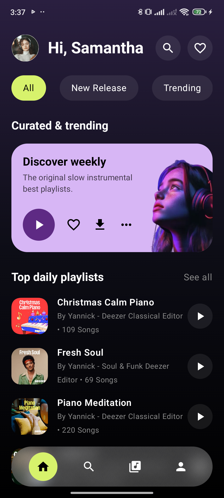
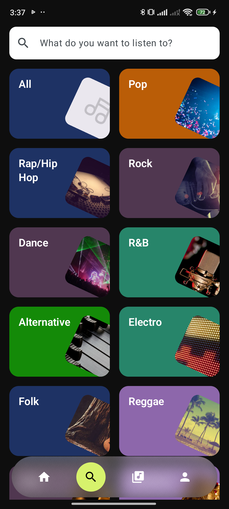
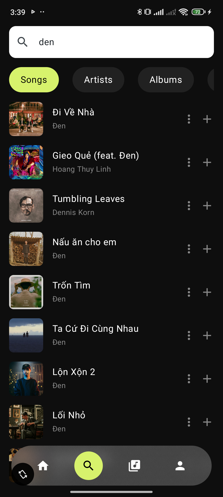
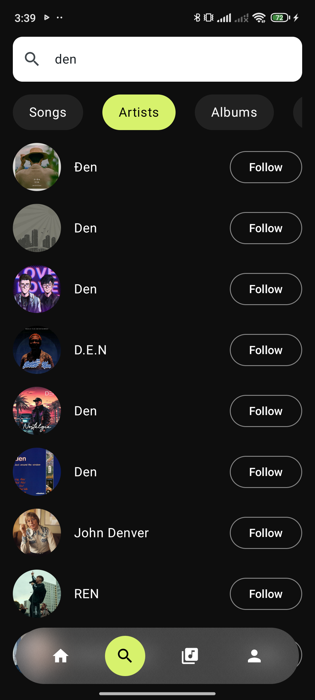
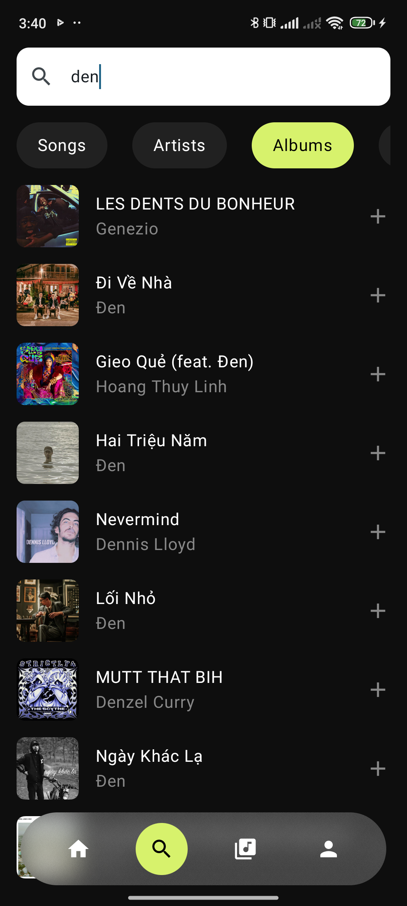
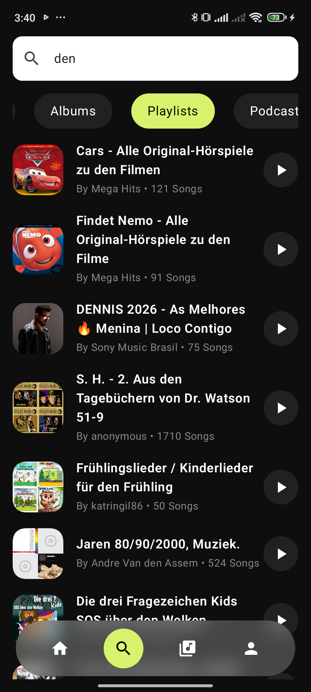
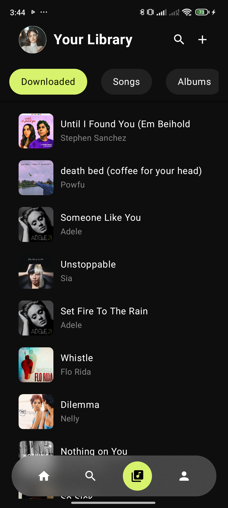
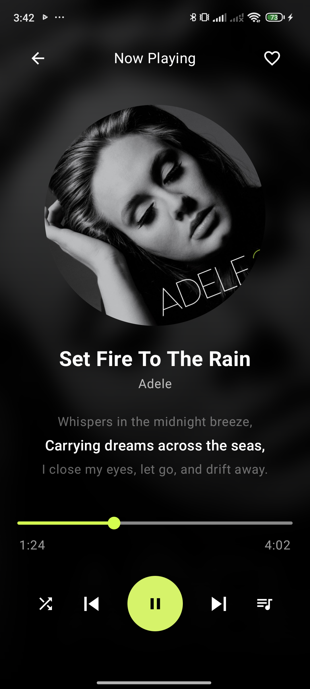

# Music Player App 🎵

**Music Player** là ứng dụng nghe nhạc hiện đại dành cho Android, được xây dựng với Material Design
3 và Jetpack Compose. Giao diện lấy cảm hứng từ các ứng dụng nghe nhạc phổ biến, tập trung vào trải
nghiệm khám phá và phát nhạc mượt mà.

## Tính năng nổi bật

- Nghe nhạc online & offline
- Tạo và quản lý playlist yêu thích
- Chia sẻ bài hát lên mạng xã hội
- Tìm kiếm bài hát, nghệ sĩ, album
- Cá nhân hóa gợi ý dựa trên lịch sử nghe

## Screenshots & Video

 

| Screen         | Image 1                                                 | Image 2                                                     | Image 3                                                       | Image 4                                                      | Image 5                                                         |
|----------------|---------------------------------------------------------|-------------------------------------------------------------|---------------------------------------------------------------|--------------------------------------------------------------|-----------------------------------------------------------------|
| Home Screen    |     |                                                             |                                                               |                                                              |                                                                 |
| Search Screen  |   |  |  |  |  |
| Library Screen |  |                                                             |                                                               |                                                              |                                                                 |                                                                 |
| Player Screen  |   |                                                             |                                                               |                                                              |                                                                 |                                                                 |

## Công nghệ sử dụng

- **Ngôn ngữ**: [Kotlin](https://kotlinlang.org/)
- **Giao diện**: [Jetpack Compose](https://developer.android.com/jetpack/compose), [Material 3](https://m3.material.io/)
- **Kiến trúc**: MVVM + Clean Architecture – dễ bảo trì, mở rộng và kiểm thử.
- **Luồng dữ liệu**: StateFlow / MutableState – quản lý trạng thái reactive.
- **Phát nhạc**: [AndroidX Media3](https://developer.android.com/guide/topics/media/media3)
- **Điều hướng**: [Navigation Compose](https://developer.android.com/jetpack/compose/navigation)
- **Dependency Injection**: Hilt
- **Lưu trữ local**: Room Database
- **Gọi API**: Retrofit + OkHttp

